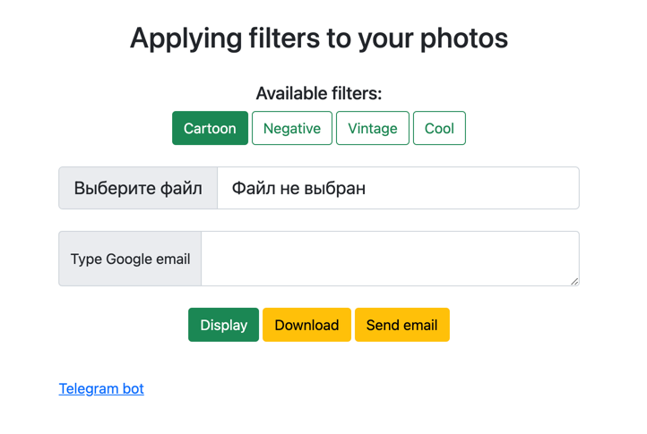

# Web application for applying filters to photos

### You can use this app to pre-process photos before uploading them to social networks or sending them to friends.

## The project consists of 2 parts:

1) __Web page__ (*flask project*) - allows you to display the filtering result on the UI, upload to disk and send by
   mail
   
2) __Telegram bot__

__Note__: You can try using the project on an already running AWT instance:

- [Telegram bot](http://t.me/filter_mipt_bot)
- [Web page](http://ec2-18-117-218-8.us-east-2.compute.amazonaws.com:5000)

## Installation guide:

1. Clone this repository:

```
git clone  https://github.com/machikhin-ka/filter-network.git
```

2. Fill in the configuration file (_config.py_):

- __MAIL_USERNAME/MAIL_DEFAULT_SENDER__ - your mail username
- __MAIL_PASSWORD__ - your mail password
- __TELEGRAM_TOKEN__ - telegram bot token (_you can create telegram bots
  using [BotFather](https://t.me/botfather)_)

3. Build docker containers:

```
docker-compose up --build
```

__Note__: The application can be opened locally at: http://localhost:5000

## How to use (_Web page_):

1. Select a filter
2. Upload a photo
3. Enter the mail to send the result to it (optional)
4. Getting results:
    - Display - display on the page
    - Download - upload to drive
    - Send mail - send the result to the email specified in 3rd point
    
